# Turkish Dictionary

It is a flutter app where you can see the meaning and details of a word.

## Tech and Libraries

- MVVM Architecture
- State Management: [Provider](https://pub.dev/packages/provider)
- Network: [Dio](https://pub.dev/packages/dio)
- Database: [Hive](https://pub.dev/packages/hive)
- Navigation: [AutoRoute](https://pub.dev/packages/auto_route)
- Localization: [EasyLocalization](https://pub.dev/packages/easy_localization)

## Screenshots

<table>
  <tr align="center">
    <th>Light Theme</th>
    <th>Dark Theme</th>
  </tr>
  <tr align="center">
    <td colspan="2">Home Screen</td>
</tr>
  <tr align="center">
    <td>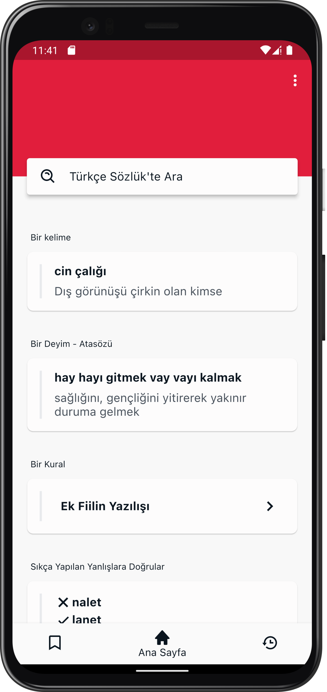</td>
    <td>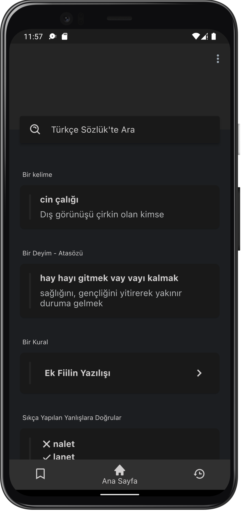</td>
  </tr>
  <tr align="center">
    <td colspan="2">Search Screen</td>
  </tr>
  <tr align="center">
    <td>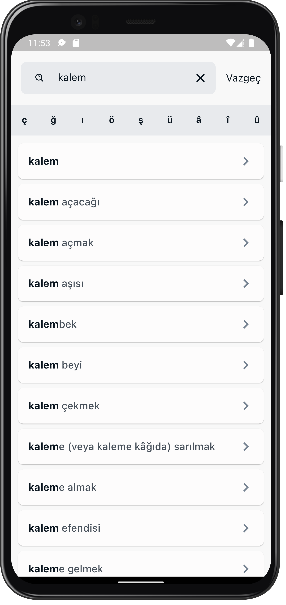</td>
    <td>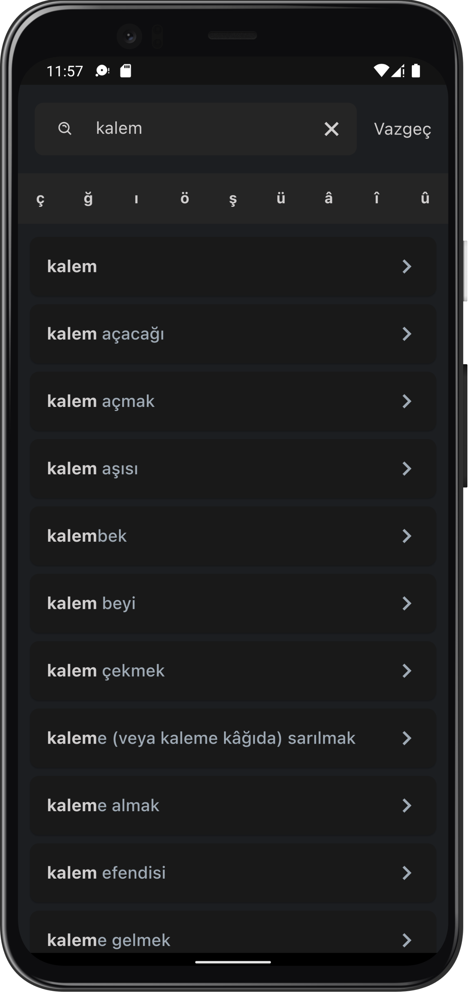</td>
  </tr>
  <tr align="center">
    <td colspan="2">Detail Screen</td>
  </tr>
  <tr align="center">
    <td>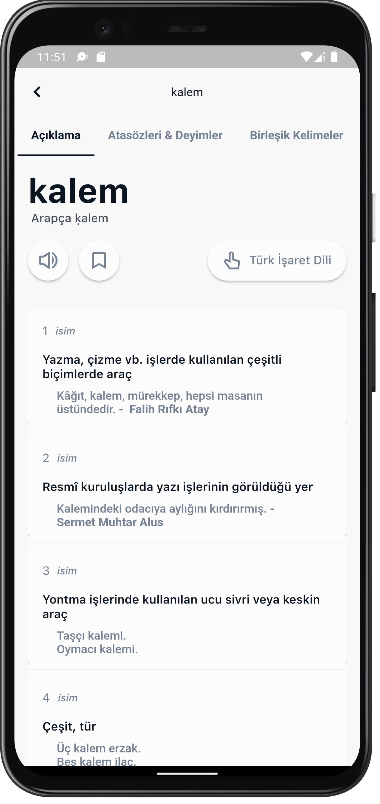</td>
    <td>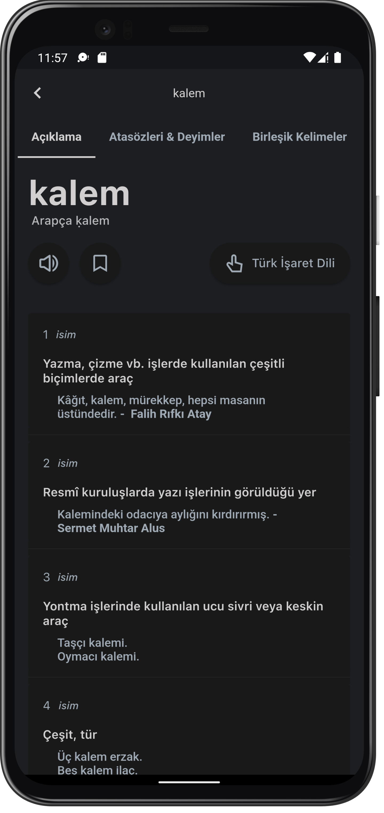</td>
  </tr>
  <tr align="center">
    <td colspan="2">Proverb & Compound Screen</td>
  </tr>
  <tr align="center">
    <td>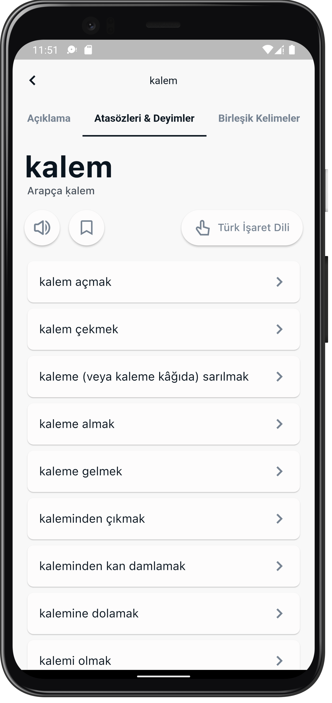</td>
    <td>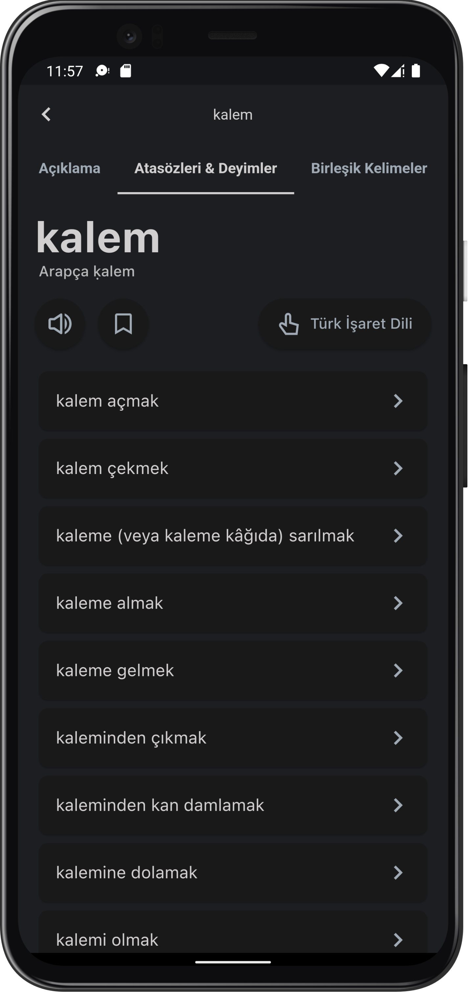</td>
  </tr>
  <tr align="center">
    <td colspan="2">Saved Screen</td>
  </tr>
  <tr align="center">
    <td>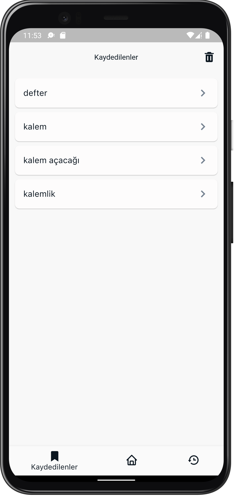</td>
    <td>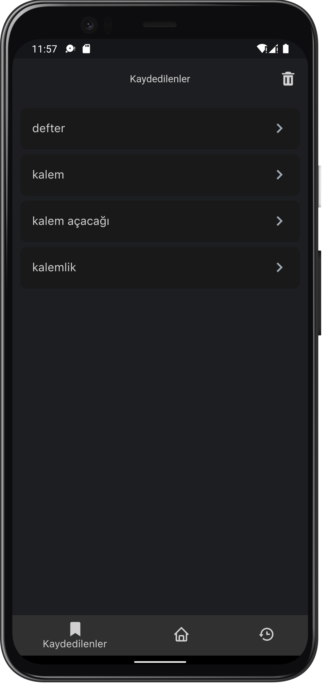</td>
  </tr>
  <tr align="center">
    <td colspan="2">History Screen</td>
  </tr>
  <tr align="center">
    <td>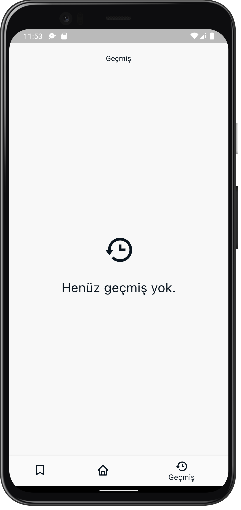</td>
    <td>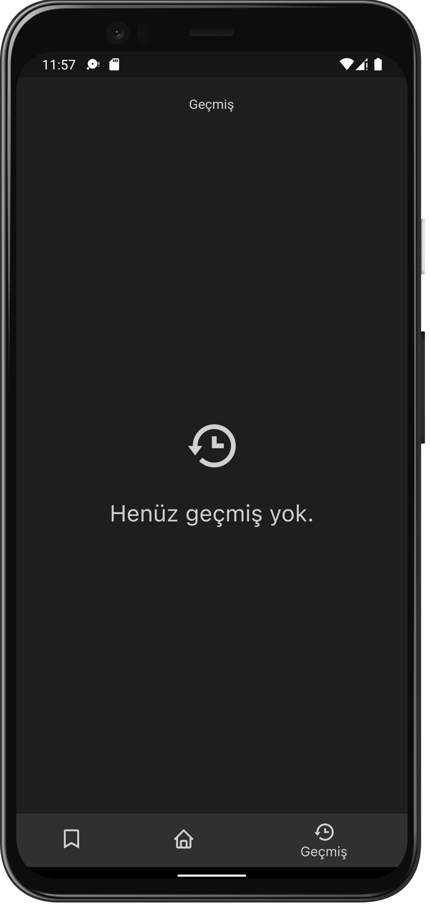</td>
  </tr>
 </table>
 
 ## Design
 - [Feyza Nur Demirci](https://dribbble.com/feyzademirci)
 - [Şahin Abut](https://dribbble.com/sahinabut)
 
 ## Resources
 [Figma File](https://www.figma.com/file/JqpfJNo6eEJzPpTOEi3Irt/TDK-Redesign)
